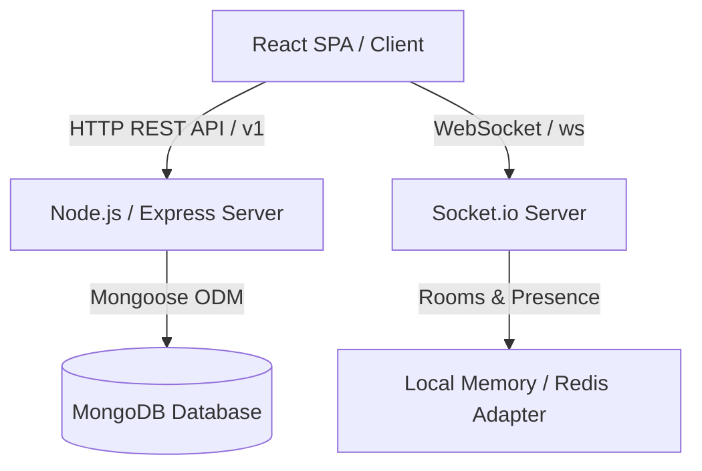

# TeamFlow — MERN Project Management & Collaboration Platform

TeamFlow is a full-stack project management and team collaboration platform using React, Express, MongoDB, TypeScript, and Socket.io.

It features secure authentication, workspace isolation, Kanban boards with drag-and-drop, sprint planning with incomplete task rollbacks, real-time presence indicators, personal notifications, chronological audit trail activity feeds, and visual analytics dashboards.

---

## Architecture Overview



---

## Directory Structure

```text
teamflow/
  client/             # React Frontend (Vite, TypeScript, Tailwind, Zustand)
  server/             # Express Backend (Node.js, TypeScript, Mongoose, Socket.io)
  shared/             # Shared Types module (reusable interfaces across frontend/backend)
  docs/               # Architectural & Deployment documentation
  docker-compose.yml  # Local MongoDB & Redis services configuration
  package.json        # Root workspace configuration for monorepo concurrency
```

---

## Local Development Setup

Follow these steps to run TeamFlow on your local machine:

### 1. Prerequisite: Databases

Ensure you have Docker and Docker Compose running, then spin up MongoDB and Redis:

```bash
npm run docker:up
```

_(Alternatively, ensure you have a local MongoDB instance running on port `27017`)_

### 2. Install Dependencies

Run the workspace install helper to fetch packages across the root, client, and server:

```bash
npm run install:all
```

### 3. Seed Demo Data

Populate the database with demo users, a workspace, projects, active sprints, tasks, comments, and logs:

```bash
npm run db:seed
```

### 4. Run Development Servers

Launch both the Vite frontend server and Express backend server concurrently:

```bash
npm run dev
```

Open [http://localhost:5173/](http://localhost:5173/) in your web browser.

---

## Seeding Details & Demo Credentials

The database seeding command (`npm run db:seed`) registers the following accounts (all use password: **`password123`**):

| Role                        | Email                 | Purpose                                                                   |
| --------------------------- | --------------------- | ------------------------------------------------------------------------- |
| **Workspace Owner (Admin)** | `admin@teamflow.com`  | Workspace-level configurations, project additions, full project accesses. |
| **Developer (Member)**      | `sarah@teamflow.com`  | Agile member, tasks updates, backlog assignments.                         |
| **Designer (Member)**       | `alex@teamflow.com`   | Member, tasks assignees.                                                  |
| **Client (Viewer)**         | `client@teamflow.com` | Read-only board and project updates, comments checking.                   |

---

## hard-to-miss highlights

- **Optimistic Drag and Drop**: Board items shift immediately, and coordinate positions in MongoDB in the background.
- **WebSocket Presence Sync**: When Sarah Developer opens a project board, her avatar immediately highlights as active in the header of all other logged-in project browsers.
- **Rollover rollbacks**: Completing an active sprint automatically resets incomplete tasks' sprint associations back to the backlog.
